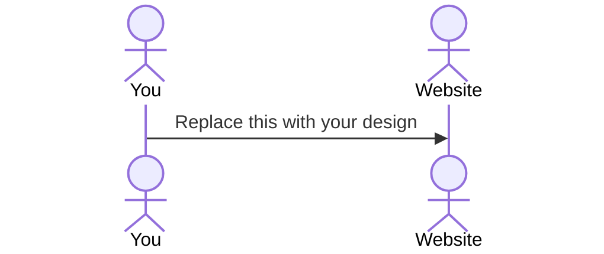

# Rise and Play

[My Notes](notes.md)

***Rise and Play*** is a web application that enable BYU students to connect and organize pickup sports both on and off campus. It provides a space where students can upload and review posts regarding different pickup sports and their time, location, and see other students involved. This enables students to find and create groups who share their similar sports interests. 

> [!NOTE]
>  This is a template for your startup application. You must modify this `README.md` file for each phase of your development. You only need to fill in the section for each deliverable when that deliverable is submitted in Canvas. Without completing the section for a deliverable, the TA will not know what to look for when grading your submission. Feel free to add additional information to each deliverable description, but make sure you at least have the list of rubric items and a description of what you did for each item.

> [!NOTE]
>  If you are not familiar with Markdown then you should review the [documentation](https://docs.github.com/en/get-started/writing-on-github/getting-started-with-writing-and-formatting-on-github/basic-writing-and-formatting-syntax) before continuing.

## 🚀 Specification Deliverable

> [!NOTE]
>  Fill in this sections as the submission artifact for this deliverable. You can refer to this [example](https://github.com/webprogramming260/startup-example/blob/main/README.md) for inspiration.

For this deliverable I did the following. I checked the box `[x]` and added a description for things I completed.

- [x] Proper use of Markdown
- [x] A concise and compelling elevator pitch
- [x] Description of key features
- [x] Description of how you will use each technology
- [x] One or more rough sketches of your application. Images must be embedded in this file using Markdown image references.

### Elevator pitch

***Rise and Play*** is a web application that enable BYU students to connect and organize pickup sports both on and off campus. It provides a space where students can upload and review posts regarding different pickup sports and their time, location, and see other students involved. This enables students to find and create groups who share their similar sports interests.

### Design

Lorem ipsum dolor sit amet, consectetur adipiscing elit, sed do eiusmod tempor incididunt ut labore et dolore magna aliqua. Ut enim ad minim veniam, quis nostrud exercitation ullamco laboris nisi ut aliquip ex ea commodo consequat. Duis aute irure dolor in reprehenderit in voluptate velit esse cillum dolore eu fugiat nulla pariatur. Excepteur sint occaecat cupidatat non proident, sunt in culpa qui officia deserunt mollit anim id est laborum.

### Key features

- Log in authenticator
- Select a channel based on sport
- Post a date, time, and location
- Allow others to commit to posts
- Potentially create groups (for events)
- In app messaging?

### Technologies

I am going to use the required technologies in the following ways.

- **HTML** - There will be two HTML pages: one for user login and registration, and another for displaying sports events. The events page will list each event with its time, location, and the number of players committed. 
- **CSS** - Website will use responsive design so it looks good on both desktop and mobile devices. It will include clean whitespace around event cards and player lists, and use a sports-themed color palette with strong contrast for easy readability.
- **React** - Will handle the core interactions of the site. Will provide login and logout functionality, display the list of events and their details, track player commitments by allowing users to join or leave events, update player counts dynamically, and make API calls to google maps.
- **Service** - Will provide endpoints to retrieve event data, submit player commitments, and fetch the current number of players for each event. It will also allow users to register, log in, and log out securely
- **DB/Login** - Will store user authentication details, all sports event information (including time, location, and description), and the commitments of players who have joined each event.
- **WebSocket** - When a user commits to or cancels their attendance for an event, WebSockets will broadcast the update so all other users see the new player count in real time.

## 🚀 AWS deliverable

For this deliverable I did the following. I checked the box `[x]` and added a description for things I completed.

- [x] **Server deployed and accessible with custom domain name** - [My server link](https://startup.riseandplay.click).

## 🚀 HTML deliverable

For this deliverable I did the following. I checked the box `[x]` and added a description for things I completed.

- [X] **HTML pages** - I created 3 distinct pages: index.html, games.html, and info.html.
- [X] **Proper HTML element usage** - I used different HTML elements to create my web application. I used within each of my html files the different html tags such as body, nav, main, header, footer, etc in order to organize and style my page. I also used "style". 
- [X] **Links** - Each of my web pages have hyperlinks that allow the viewer to navigate between pages. These are included at the top and I also started making a bar for mobile using Boostrap. 
- [X] **Text** - I included text within my webpage. The text can be seen by the title, within the different boxes, in the footer, and part of the body for my games and info pages. 
- [X] **3rd party API placeholder** - I created a box for the google maps api on the games page!
- [X] **Images** - I included a logo for my website on the info page and I plan to implement it in other parts of the website with CSS. 
- [X] **Login placeholder** - I included a login placeholder in the index page and I should be able to update automatically with java script in the top right corner the "logged in as". 
- [X] **DB data placeholder** - I have a placeholder for my data base where all the past activities will be stored and shown by the server on the games page. 
- [X] **WebSocket placeholder** - I also made the activities box the place where the websocket holder will be displayed as it will update as people create and upload new activities on the games page. 

## 🚀 CSS deliverable

For this deliverable I did the following. I checked the box `[x]` and added a description for things I completed.

- [X] **Header, footer, and main content body** - I made my header include a title, nav elements, and a sign in username placeholder. These are styled with color and spaced. I have a footer that doesn't overlap content and includes my name and github. I have a main content body that is properly styled and spaced out. 
- [X] **Navigation elements** - I have a navigation bar with a hamburger button that uses bootstrap to make a responsive menu.
- [X] **Responsive to window resizing** - When I move my window around, the elements autonmatically expand or collapse so that the view is always visible on boht computer and mobile. 
- [x] **Application elements** - I created buttons on the sign in page. I also have a form creation area on my games.html page where people can create and post their activity. There is a small hover animation on the last content box in the info page. 
- [X] **Application text content** - There is text on every page including titles, paragraphs, and info boxes to guide users in using the application. 
- [X] **Application images** - I styled my website logo on the info page to be in a box and look cool. It can also expand to meet the window resize requirements. 

## 🚀 React part 1: Routing deliverable

For this deliverable I did the following. I checked the box `[x]` and added a description for things I completed.

- [X] **Bundled using Vite** - I downloaded and installed everything needed to bundle my application with Vite. 
- [X] **Components** - I was able to route my webapplication using the app.jsx file to build out my header and footer elements. then using BrowserRouter and the Route code pieces I was able to call the different parts of my website using react components and triggering the functions wihtin my jsx files for each page of my website. These I was able to isolate into a single file by moving my main HTML elements over and I was able to make everything fully functional. 
- [X] **Router** - I was able to build out the router within my app.css to route between the different react components instead of loading up new pages each time. This ended up being a bit difficult because a few small typos occured while I was importing the functions "jsx files", but I was able to debug everything so it went well. 

## 🚀 React part 2: Reactivity deliverable

For this deliverable I did the following. I checked the box `[x]` and added a description for things I completed.

- [X] **All functionality implemented or mocked out** - In terms of functionality I worked on implementing the Login feature to retain the authentication when I'm inside the application. This will automatically hide or show the Games page which enables functionality. Then I worked on making a placeholder for the google maps API and getting it set up for later on once I get an API key and wire it in. I then added functionality within the actual activity creation sheet, so now users can create activties which are now displayed below the Activty Feed in cards. These cards are scrollable and are linked to the activity creation form. I also created a deletion button and unique ID system for each of these Activity Cards. 
- [X] **Hooks** - With webhooks I was able to implement various hooks within my games.jsx file. Primarily this serves to track and pull information from the form to be implemented within the activity cards. This is done with useState. Then I used useEffect to provide a list of the current activities in activity feed from the users local storage. Whenever the activities change, I use the useEffect hook to update the local storage and eventually the UI. 

## 🚀 Service deliverable

For this deliverable I did the following. I checked the box `[x]` and added a description for things I completed.

- [X] **Node.js/Express HTTP service** - In my service directory I added an index.js file where I intiialized Express and Node and started listening on port 4000. I also added the middleware with app.use() to get the json files and parse cookies. 
- [X] **Static middleware for frontend** - Within my index.js file I added app.use(express.static('public')); and app.use((_req, res) => {res.sendFile('index.html', { root: 'public' }); in order to host on the front end so that Service will manage the static files in production. 
- [X] **Calls to third party endpoints** - I have a google maps api call on the games map. I created an api key and have included it in .env, which maintains it and allows me to pull in the google maps info and box through my mapBox.jsx. 
- [X] **Backend service endpoints** - I've built out in index.js under const api = express.Router(); app.use('/api', api); json endpoints that return and accept data. This includes both authentication and the user profile. I also have endpoints for managing the games page which will only allow posting and deleting activties when the user is logged in. 
- [X] **Frontend calls service endpoints** - During the log in process unauthenticated.jsx and authenticated.jsx both make calls to the back end with fetch to login and logout. I also made it so the game page UI makes a call to retrieve the list and then functions for both posting and deleting activity cards. (games.jsx)
- [X] **Supports registration, login, logout, and restricted endpoint** - For backend within index.jsx I made a create user registration function which also sets a cookie using setAuthCookie for login and verification. This also includes the logout function in authenticated.jsx which flips the state to unathenticated. In the games.jsx then there are get, post, and delete calls which are restricted to users who are signed in. As of now users who are not verified through the login process will have read only access on the activities page. The backend fetch calls validate if the user has authenticated priveleges.

## 🚀 DB deliverable

For this deliverable I did the following. I checked the box `[x]` and added a description for things I completed.

- [X] **Stores data in MongoDB** - I created my database with mongodb and using the username and password I was able to create a dbConfig.json file to store these credentials and then wire them into the database.js file to connect my backend calls to the database. I then changed my functions within database.js to include async functions that retrieve, store, and add information about the user and the activities form to the mongo database. I then edited the games.jsx file to use the api/activties call to the actual database instead of the local storage. I then verified this by looking at "data" on my database to see the json like objects stored there with the user data and the actvities forms. 
- [X] **Stores credentials in MongoDB** - I use the api/auth/create call to create or verify the users information within the database which can then be checked or saved by using the DB. for the database. Ex: 

fetch('/api/auth/create', {
  method: 'POST',
  headers: {'Content-Type': 'application/json'},
  body: JSON.stringify({ email: userName, password })
});

and I also added a hasher with bycript to add a layer of security to passwords before I stoer them in the database. 

const passwordHash = await bcrypt.hash(password, 10);
const user = { email, password: passwordHash, token: uuid.v4() };
await DB.addUser(user);

This appears in the database as something like:

_id
69155993b9fa6f8765f
email
"Caden"
password
"$2b$10$ha8NL/mMdyU1FxJVw078FOKNrbSq2bK6n0jO"
token
"0c10f79c-4c87-8486cad4b502"

## 🚀 WebSocket deliverable

For this deliverable I did the following. I checked the box `[x]` and added a description for things I completed.

- [X] **Backend listens for WebSocket connection** - I added a peerProxy WebSocket server that attaches to the same HTTP server used by Express. By putting the WS server to server.listen() and adding the /ws upgrade path the backend can accept and manages live WebSocket connections. Now multiple people can connect and receive reel time updates about activties. 
- [X] **Frontend makes WebSocket connection** - In the Games.jsx file I put a custom hook "useActivitiesWebSocket" that opens a WebSocket connection using ws/wss and the /ws path. When the browser loads the Activities page the hook automatically initializes the WebSocket and handles open/error/close events and keeps the connection alive. This makes it so every tab and/or device is connected to the backend WebSocket server.
- [X] **Data sent over WebSocket connection** - After somebody posts a new activity the frontend calls sendWs('activity:new', activity) which sends a JSON message through the active WebSocket connection. The backend receives the message and broadcasts it to all connected people and leaves out the sender. This creates a real time updates in the system between all the possible users.
- [X] **WebSocket data displayed** - Incoming WebSocket messages are processed on the frontend inside ws.onmessage and when a message of type "activity:new' is detected the new activity is added to the Activities list. This makes it so that when any user adds a new activity all open browser tabs should display it without needing to refresh.
- [X] **Application is fully functional** - My app now supports real user accounts which are stored in MongoDB. There is activity storage, secure login/logout, and working real time activity updates using WebSockets. The frontend and backend communicate over both HTTP and WebSocket and the deployed production version works on the actual domain!
