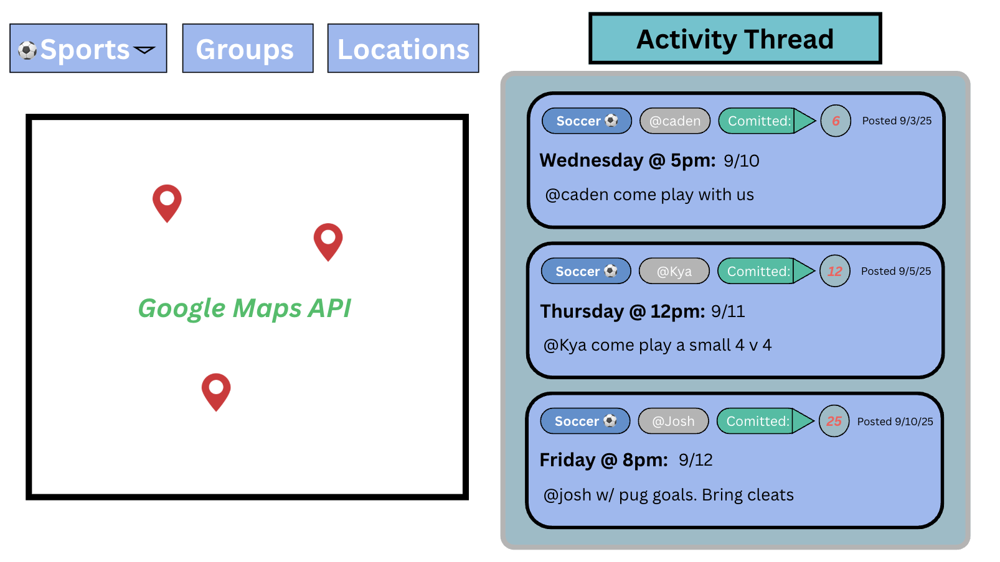
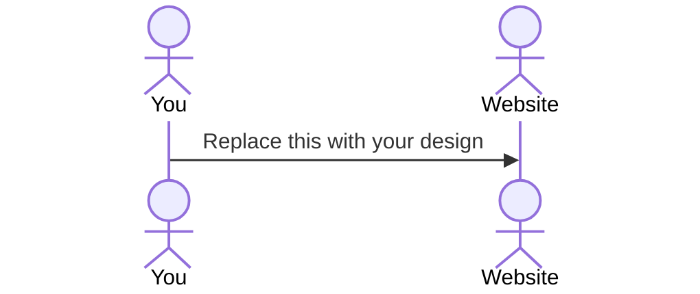

# Rise and Play

[My Notes](notes.md)

***Rise and Play*** is a web application that enable BYU students to connect and organize pickup sports both on and off campus. It provides a space where students can upload and review posts regarding different pickup sports and their time, location, and see other students involved. This enables students to find and create groups who share their similar sports interests. 

> [!NOTE]
>  This is a template for your startup application. You must modify this `README.md` file for each phase of your development. You only need to fill in the section for each deliverable when that deliverable is submitted in Canvas. Without completing the section for a deliverable, the TA will not know what to look for when grading your submission. Feel free to add additional information to each deliverable description, but make sure you at least have the list of rubric items and a description of what you did for each item.

> [!NOTE]
>  If you are not familiar with Markdown then you should review the [documentation](https://docs.github.com/en/get-started/writing-on-github/getting-started-with-writing-and-formatting-on-github/basic-writing-and-formatting-syntax) before continuing.

## 🚀 Specification Deliverable

> [!NOTE]
>  Fill in this sections as the submission artifact for this deliverable. You can refer to this [example](https://github.com/webprogramming260/startup-example/blob/main/README.md) for inspiration.

For this deliverable I did the following. I checked the box `[x]` and added a description for things I completed.

- [x] Proper use of Markdown
- [x] A concise and compelling elevator pitch
- [x] Description of key features
- [x] Description of how you will use each technology
- [x] One or more rough sketches of your application. Images must be embedded in this file using Markdown image references.

### Elevator pitch

***Rise and Play*** is a web application that enable BYU students to connect and organize pickup sports both on and off campus. It provides a space where students can upload and review posts regarding different pickup sports and their time, location, and see other students involved. This enables students to find and create groups who share their similar sports interests.

### Design

Lorem ipsum dolor sit amet, consectetur adipiscing elit, sed do eiusmod tempor incididunt ut labore et dolore magna aliqua. Ut enim ad minim veniam, quis nostrud exercitation ullamco laboris nisi ut aliquip ex ea commodo consequat. Duis aute irure dolor in reprehenderit in voluptate velit esse cillum dolore eu fugiat nulla pariatur. Excepteur sint occaecat cupidatat non proident, sunt in culpa qui officia deserunt mollit anim id est laborum.

### Key features

- Log in authenticator
- Select a channel based on sport
- Post a date, time, and location
- Allow others to commit to posts
- Potentially create groups (for events)
- In app messaging?

### Technologies

I am going to use the required technologies in the following ways.

- **HTML** - There will be two HTML pages: one for user login and registration, and another for displaying sports events. The events page will list each event with its time, location, and the number of players committed. 
- **CSS** - Website will use responsive design so it looks good on both desktop and mobile devices. It will include clean whitespace around event cards and player lists, and use a sports-themed color palette with strong contrast for easy readability.
- **React** - Will handle the core interactions of the site. Will provide login and logout functionality, display the list of events and their details, track player commitments by allowing users to join or leave events, update player counts dynamically, and make API calls to google maps.
- **Service** - Will provide endpoints to retrieve event data, submit player commitments, and fetch the current number of players for each event. It will also allow users to register, log in, and log out securely
- **DB/Login** - Will store user authentication details, all sports event information (including time, location, and description), and the commitments of players who have joined each event.
- **WebSocket** - When a user commits to or cancels their attendance for an event, WebSockets will broadcast the update so all other users see the new player count in real time.

## 🚀 AWS deliverable

For this deliverable I did the following. I checked the box `[x]` and added a description for things I completed.

- [x] **Server deployed and accessible with custom domain name** - [My server link](https://startup.riseandplay.click).

## 🚀 HTML deliverable

For this deliverable I did the following. I checked the box `[x]` and added a description for things I completed.

- [X] **HTML pages** - I created 3 distinct pages: index.html, games.html, and info.html.
- [X] **Proper HTML element usage** - I used different HTML elements to create my web application. I used within each of my html files the different html tags such as body, nav, main, header, footer, etc in order to organize and style my page. I also used "style". 
- [X] **Links** - Each of my web pages have hyperlinks that allow the viewer to navigate between pages. These are included at the top and I also started making a bar for mobile using Boostrap. 
- [X] **Text** - I included text within my webpage. The text can be seen by the title, within the different boxes, in the footer, and part of the body for my games and info pages. 
- [X] **3rd party API placeholder** - I created a box for the google maps api!
- [X] **Images** - I included a logo for my website on the info page and I plan to implement it in other parts of the website with CSS. 
- [X] **Login placeholder** - I included a login placeholder in the index page and I should be able to update automatically with java script in the top right corner. 
- [X] **DB data placeholder** - I have a placeholder for my data base where all the past activities will be stored and shown by the server on the games page. 
- [X] **WebSocket placeholder** - I also made the activities box the place where the websocket holder will be displayed as it will update as people create and upload new activities. 

## 🚀 CSS deliverable

For this deliverable I did the following. I checked the box `[x]` and added a description for things I completed.

- [ ] **Header, footer, and main content body** - I did not complete this part of the deliverable.
- [ ] **Navigation elements** - I did not complete this part of the deliverable.
- [ ] **Responsive to window resizing** - I did not complete this part of the deliverable.
- [ ] **Application elements** - I did not complete this part of the deliverable.
- [ ] **Application text content** - I did not complete this part of the deliverable.
- [ ] **Application images** - I did not complete this part of the deliverable.

## 🚀 React part 1: Routing deliverable

For this deliverable I did the following. I checked the box `[x]` and added a description for things I completed.

- [ ] **Bundled using Vite** - I did not complete this part of the deliverable.
- [ ] **Components** - I did not complete this part of the deliverable.
- [ ] **Router** - I did not complete this part of the deliverable.

## 🚀 React part 2: Reactivity deliverable

For this deliverable I did the following. I checked the box `[x]` and added a description for things I completed.

- [ ] **All functionality implemented or mocked out** - I did not complete this part of the deliverable.
- [ ] **Hooks** - I did not complete this part of the deliverable.

## 🚀 Service deliverable

For this deliverable I did the following. I checked the box `[x]` and added a description for things I completed.

- [ ] **Node.js/Express HTTP service** - I did not complete this part of the deliverable.
- [ ] **Static middleware for frontend** - I did not complete this part of the deliverable.
- [ ] **Calls to third party endpoints** - I did not complete this part of the deliverable.
- [ ] **Backend service endpoints** - I did not complete this part of the deliverable.
- [ ] **Frontend calls service endpoints** - I did not complete this part of the deliverable.
- [ ] **Supports registration, login, logout, and restricted endpoint** - I did not complete this part of the deliverable.

## 🚀 DB deliverable

For this deliverable I did the following. I checked the box `[x]` and added a description for things I completed.

- [ ] **Stores data in MongoDB** - I did not complete this part of the deliverable.
- [ ] **Stores credentials in MongoDB** - I did not complete this part of the deliverable.

## 🚀 WebSocket deliverable

For this deliverable I did the following. I checked the box `[x]` and added a description for things I completed.

- [ ] **Backend listens for WebSocket connection** - I did not complete this part of the deliverable.
- [ ] **Frontend makes WebSocket connection** - I did not complete this part of the deliverable.
- [ ] **Data sent over WebSocket connection** - I did not complete this part of the deliverable.
- [ ] **WebSocket data displayed** - I did not complete this part of the deliverable.
- [ ] **Application is fully functional** - I did not complete this part of the deliverable.
